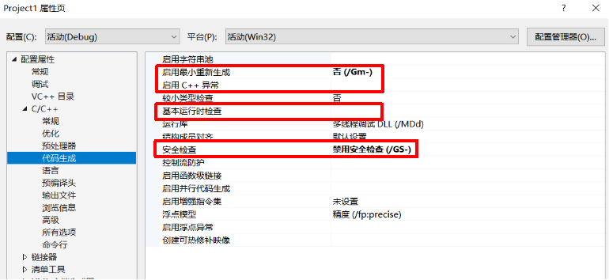
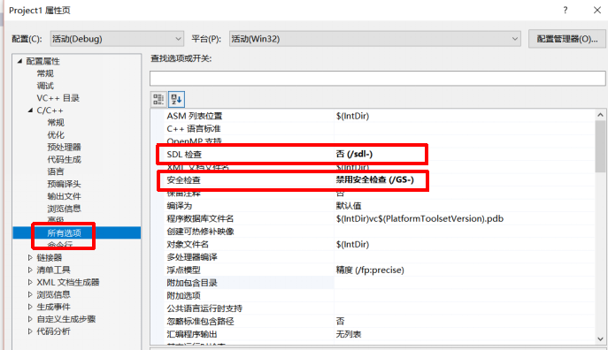
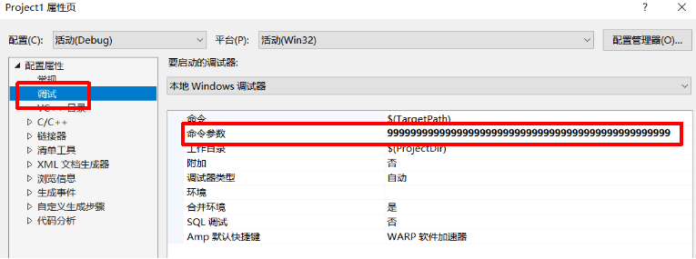
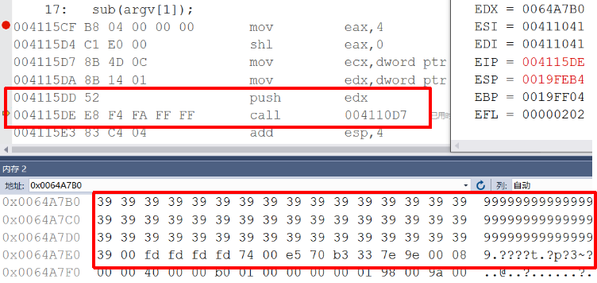
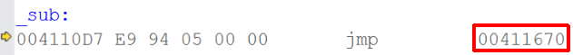
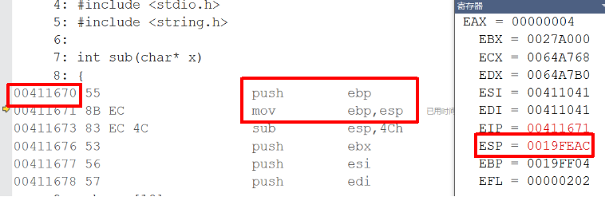
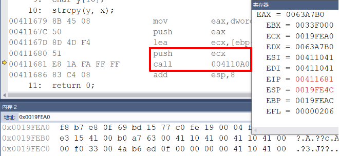
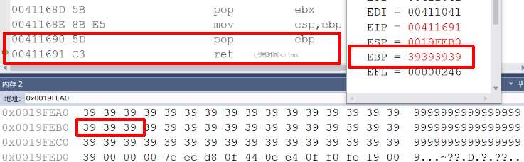
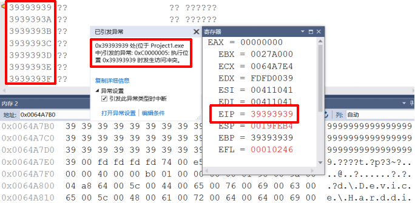
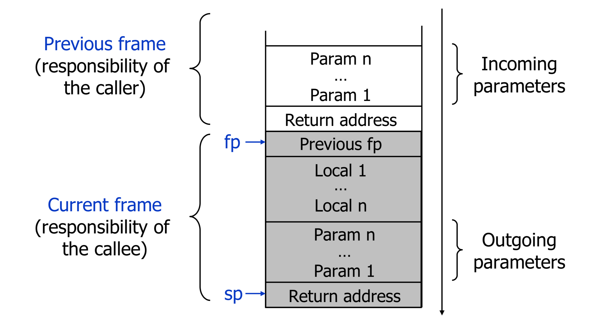

# 实验一 栈结构的构造与缓冲区溢出

## 一、实验目的
* 编写程序调用子函数，通过反汇编找到调用子函数机器码，查看函数内存地址的变化，分析栈帧结构及其在函数调用中的作用  
* 设置特殊值参数，造成缓冲区溢出，分析函数安全性  

## 二、实验内容
### 1.实验前设置环境，在属性——>C/C++——>代码生成、所有选项中设置对应值。  


* c++异常、基本运行时检查、安全检查

### 2.编写代码，使得main函数调用sub子函数，sub函数中调用系统函数strcpy。
```
#define _CRT_SECURE_NO_WARNINGS

#include <stdlib.h>
#include <stdio.h>
#include <string.h>

int sub(char* x)
{
 char y[10];
 strcpy(y, x);
 return 0;
}

int main(int argc, char** argv)
{
 if (argc > 1)
  sub(argv[1]);
 printf("exit");
}
```

### 3.传递参数，使得缓冲区有溢出的可能。在调试——>命令参数中设置参数为较长且不带空格的字符串。


### 4.在main函数中调用下断点，进行调试，通过反汇编查看  
* 可以看到在main函数的栈帧中，push指令传递参数，call指令所在内存地址004115DE，指向内存地址004110D7为跳转子函数sub()所在的内存地址的命令。


* call指令压栈，保留回到主函数的地址（ESP指向返回地址），改变eip寄存器，其中jmp改变了程序执行的流程，没有进行数据的操作。 
* 可以看到esp的值略大于ebp
* 要给ebp赋值，先将原来的值压栈保存，然后赋值

* 同样的，sub()函数内部调用strcpy(),再次构造类似的栈帧，调用结束后，返回sub()函数。

* sub()函数调用结束，返回main()函数，栈帧中ebp本应保存main函数基址，但是由于变量大小远小于参数大小，缓冲区溢出，导致ebp被覆盖，无法返回main函数所在的内存地址，程序崩溃。

  

## 三、实验结论  
### 1.函数的栈帧
* 在函数调用的时候，首先进行的是参数传递的工作，有几个参数就进行几次push。把这个过程叫做参数压栈。esp永远都是栈顶指针。
* 在完成参数压栈以后，马上进行call指令执行，call指令会把它的下一条指令的地址压入栈中，并跳转到被调用的函数的内部执行。
* 函数调用过程：  
    * 参数入栈: 将参数按照调用约定(C 是从右向左)依次压入系统栈中;
    * 返回地址入栈: 将当前代码区调用指令的下一条指令地址压入栈中，供函数返回时继续执行;
    * 代码跳转: 处理器将代码区跳转到被调用函数的入口处;
    * 栈帧调整: 
        * 将调用者的ebp压栈处理，保存指向栈底的ebp的地址（方便函数返回之后的现场恢复），此时esp指向新的栈顶位置； push ebp
        * 将当前栈帧切换到新栈帧(将eps值装入ebp，更新栈帧底部), 这时ebp指向栈顶，而此时栈顶就是old ebp  `mov ebp, esp `
        * 给新栈帧分配空间 `sub esp, XXX`
* 函数返回过程：  
    * 保存被调用函数的返回值到 eax 寄存器中 `mov eax, xxx `
    * 恢复 esp 同时回收局部变量空间 `mov ebp, esp `
    * 将上一个栈帧底部位置恢复到ebp ` pop ebp `
    * 弹出当前栈顶元素,从栈中取到返回地址,并跳转到该位置 `ret`   
  

### 2.缓冲区溢出  
* 函数调用过程中的局部变量是紧跟着ebp指针的，一旦发生溢出，存储的数据往地址高位走就会覆盖这个关键的值，如果程序修改指令的地址让它指向一段有害的代码，或者修改ebp指针使得返回的时候到一个有害的函数处，这就是所谓的"缓冲区溢出"。  