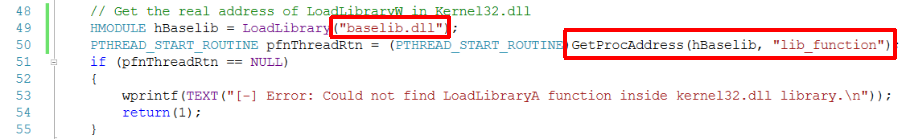

# API Hook
- - - 
# 课堂实验 查看当前进程
* 调用API函数(MessageBoxA)，在反汇编中查看函数地址，该地址是固定的，但是里面保存的指针的值变化  
  

* 单步执行，程序跳转到指定地址，可以看到该程序的导出表  

* 在Bash中xxd查看.exe文件的信息
    * MZ开头，f0代表偏移f0。偏移到f0，所存信息为PE。  
    
* 可以解析PE 文件的工具： dumpbin /headers、PE explorer  
    * 其中time date stamp时间戳是从1970年1月1日早上8点整开始的秒数，通过计算解析为可读性较强的时间格式  
   
  
* PE explorer查看.exe文件的导入库   
  
* 把main.c和iathook.c添加到项目中，在VS中编译链接出main.exe，运行main.exe，可以看到第一次跳出窗口时API被hook到自行编写的Fake_MessageBoxA，解扣后第二次跳出窗口时才正确调用了系统函数MessageBoxA   
  

- - - 
# 作业
## 一、实验要求
* 查文档，研究远程线程方式注入dll的实例代码的实现原理
* 运行实例代码，向一个目标程序（比如notepad.exe)注入一个自行编写的dll，加载运行
* 整合进程遍历的程序，使得攻击程序可以自己遍历进程得到目标程序的pid


## 二、实验内容
### 1.向一个notepad.exe注入一个自行编写的dll
* 修改baselib.c文件，当运行notepad.exe时运行.dll文件中编写的dll main，跳出loaded窗口  
   
  
  

* 注意：
    * baselib.dll文件需要放在..\dllinject文件夹下(与.c文件在同一目录下)  
    * 打开的notepad.exe应该是在```C:\Windows\SysWOW64```目录下的exe文件  
    * 再次打开notepad.exe应该重新查看进程的pid，修改程序main函数  

* 向一个目标程序（本实验以notepad++程序为例)注入一个自行编写的dll，实现字符篡改   
    * 用notepad++.exe打开test.txt文件，输入字符
    * 在命令行中以`hookdbg.exe <pid>`命令格式，将notepad++.exe的writefile()函数hook到自己编写的函数中，保存txt中的文本内容，将字符串中所有小写字母改为大写字母   
           
           
* 编写代码，使得攻击程序可以自己遍历进程得到目标程序的pid   
        
        
* 整合进程遍历的程序，修改代码。在命令行中以`hookdbg.exe`命令格式，将notepad++.exe的writefile()函数hook到自己编写的函数中，保存txt中的文本内容，将所有字符串“haha”改为字符串“hehe”      
       

## 三、实验遇到问题   
* 一开始使用notepad.exe始终无法成功注入，后来更改使用在```C:\Windows\SysWOW64```目录下的exe文件，但最终篡改字符的注入实验仍然没有成功，使用notepad++.exe才完成实验    
